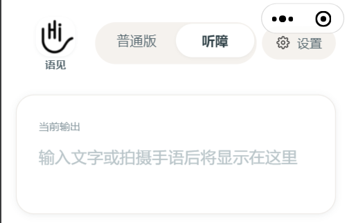
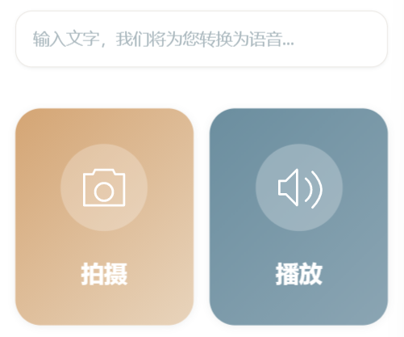
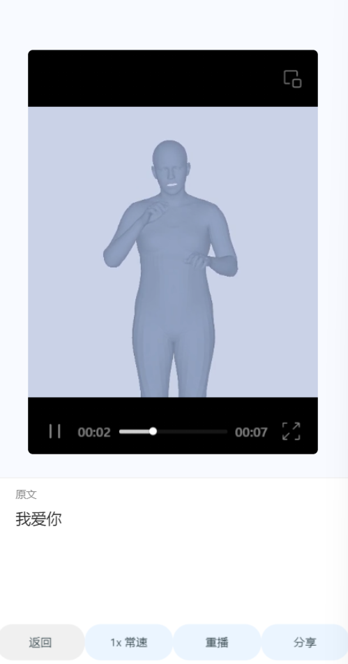
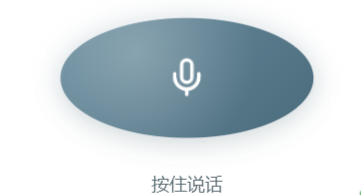
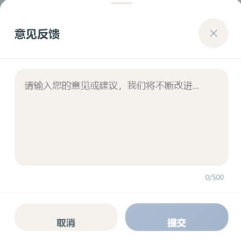

# 语见用户手册

**版本**：V1.0
**更新日期**：2024年4月

---

## 目录

1. [前言](#前言)
2. [快速开始](#快速开始)
3. [第一章 初识语见](#第一章-初识语见)
4. [第二章 首页功能详解](#第二章-首页功能详解)
   - 2.1 [听障模式](#21-听障模式)
   - 2.2 [普通模式](#22-普通模式)
5. [第三章 手语翻译功能](#第三章-手语翻译功能)
   - 3.1 [手语识别（手语→文字/语音）](#31-手语识别手语文字语音)
   - 3.2 [手语生成（文字→手语动画）](#32-手语生成文字手语动画)
6. [第四章 快捷短语](#第四章-快捷短语)
7. [第五章 心理咨询助手](#第五章-心理咨询助手)
8. [第六章 设置与个性化](#第六章-设置与个性化)
9. [第七章 常见问题解答](#第七章-常见问题解答)
10. [附录](#附录)

---

## 前言

> **"无声世界，语见其声"**

语见是一款专为无障碍沟通打造的AI手语双向翻译与生成系统，致力于搭建听障人士与健听人群之间的沟通桥梁。

**我能用语见做什么？**

| 如果您是... | 语见可以帮您... |
|:-----------|:---------------|
| 🧏 听障人士 | 用手语与不懂手语的人交流；输入文字让手机帮您"说话" |
| 🎧 健听人士 | 学习手语；将语音/文字转换为手语动画给听障朋友看 |
| 👨‍👩‍👧 听障人士的家人 | 快速学习常用手语；更好地与亲人沟通 |
| 🏥 服务行业从业者 | 为听障顾客提供无障碍服务 |

---

## 快速开始

### 第一步：下载与安装

在微信中搜索"语见"小程序，或扫描下方二维码进入：

> 📷 **二维码占位**：建议在此处放置小程序二维码

### 第二步：选择使用模式

首次打开语见，请选择适合您的模式：

| 模式 | 适合人群 | 核心功能 |
|:----:|:--------:|:---------|
| **文字手语模式**<br>（听障版） | 听障用户、视力不佳的用户 | • 文字转语音播报<br>• 手语识别翻译<br>• 快捷短语一键发送<br>• 大字体大按钮设计 |
| **语音说话模式**<br>（普通版） | 健听用户、手语学习者 | • 语音转文字<br>• 文字转手语动画<br>• 手语学习资料 |

💡 **提示**：选择错误不用担心，之后随时可以切换。

### 第三步：开始使用

**听障用户快速上手：**
1. 在输入框打字 → 点击播放按钮 → 手机语音播报
2. 点击相机按钮 → 拍摄对方手语 → 查看识别结果
3. 点击快捷短语 → 一键发送常用语

**健听用户快速上手：**
1. 按住麦克风说话 → 自动转文字
2. 点击生成手语 → 查看3D手语动画
3. 点击手语识别 → 拍摄听障朋友的手语

---

## 第一章 初识语见

### 1.1 语见的四大核心功能

```
┌─────────────────────────────────────────────────────────────┐
│                      语见功能全景图                           │
├─────────────────────────────────────────────────────────────┤
│                                                             │
│   🎯 手语识别          🎬 手语生成                           │
│   手语 → 文字/语音     文字/语音 → 3D手语动画                 │
│                                                             │
│   ⚡ 快捷短语          💚 心理咨询                           │
│   一键发送常用语       AI情感陪伴与心理疏导                   │
│                                                             │
└─────────────────────────────────────────────────────────────┘
```

### 1.2 首次使用设置

当您第一次打开语见，会看到温馨的引导页面：


*图1-1：应用启动引导页——选择语言和模式*

**设置步骤：**

1. **选择语言**：简体中文 / English / Deutsch
2. **选择模式**：
   - 文字手语模式（听障版）：大按钮、大字体、快捷短语
   - 语音说话模式（普通版）：语音识别、手语动画生成
3. 点击"进入应用"

💡 **提示**：这些设置之后都可以在"设置"页面随时更改。

---

## 第二章 首页功能详解

语见首页根据您选择的模式呈现不同的布局：

### 顶部导航栏（两种模式通用）


*图2-1：顶部导航栏——品牌标识、模式切换、设置入口*

| 区域 | 功能说明 |
|:----:|:---------|
| 左侧 | 语见品牌标识 |
| 中央 | **模式切换器**——点击切换听障版/普通版 |
| 右侧 | **设置按钮**（齿轮图标）——进入设置页面 |

⚠️ **注意**：模式切换是全局设置，切换后整个应用的所有页面都会相应调整。

---

### 2.1 听障模式

听障模式的界面设计原则是：**大、清、快**
- **大**：大按钮、大字体，方便点击和阅读
- **清**：界面简洁，功能一目了然
- **快**：快捷短语一键发送，减少输入时间


*图2-2：输出区域——显示您输入的文字内容*

#### 2.1.1 文字输入与语音播报


*图2-3：输入区域和播放按钮*

**操作步骤：**
1. 点击输入框
2. 输入想要表达的文字
3. 点击右侧的**橙色播放按钮**
4. 手机会自动语音播报这段文字

💡 **提示**：
- 播放按钮带有波纹动画，给您明确的操作反馈
- 播报时按钮会显示波形动画，表示正在播放
- 使用ChatTTS技术，语音自然流畅

#### 2.1.2 手语识别

点击页面中部的**大相机按钮**，进入手语识别：

**操作流程：**
```
点击相机按钮 → 选择相册/拍摄 → 录制手语视频 → 等待识别 → 查看结果
```


*图2-4：相机页面——大按钮设计，操作清晰*


*图2-5：录制中状态——红色按钮+倒计时提示*

**录制按钮状态说明：**

| 状态 | 外观 | 说明 |
|:----:|:----:|:-----|
| 未录制 | 白色圆形 | 点击开始录制 |
| 录制中 | 红色+脉冲动画 | 显示30秒倒计时 |
| 录制完成 | 绿色确认提示 | 自动进入识别 |

⚠️ **注意**：
- 每次最长录制30秒
- 建议在光线充足、背景简洁的环境下拍摄
- 尽量使用标准的中国手语动作

#### 2.1.3 快捷短语


*图2-6：快捷短语区域——常用语一键发送*

快捷短语让您无需打字，一键发送常用表达：

**颜色编码系统：**

| 颜色 | 类型 | 示例 |
|:----:|:----:|:-----|
| 🔴 红色 | 紧急类 | "我需要帮助"、"请帮我叫救护车" |
| 🔵 蓝色 | 日常类 | "谢谢"、"早上好"、"再见" |
| ⚫ 灰色 | 业务类 | "我想办理业务"、"请出示证件" |

**管理快捷短语：**
- **添加**：点击"+"按钮 → 输入短语 → 选择类型 → 确认添加
- **删除**：长按任意短语进入编辑模式 → 点击要删除的短语

💡 **提示**：自定义短语上限为15条，达到上限需先删除部分短语。

#### 2.1.4 心理健康入口


*图2-7：心理健康助手入口——绿色爱心标识*

点击绿色爱心卡片，进入AI心理咨询页面，获得情感陪伴。

---

### 2.2 普通模式

普通模式面向健听用户，界面更紧凑，信息密度更高，核心功能是：**语音输入** 和 **手语学习**。


*图2-8：文字转手语功能区——输入文字生成3D手语动画*

#### 2.2.1 文字转手语动画

**操作步骤：**
1. 在中央输入框输入文字（如"你好，很高兴认识你"）
2. 点击"生成手语"按钮
3. 等待约10秒生成时间（显示圆形进度环）
4. 在全屏播放器中查看3D手语动画


*图2-9：生成进度界面——圆形进度环实时显示进度*

**播放器控制说明：**

| 功能 | 操作 | 适用场景 |
|:----:|:----:|:---------|
| 播放/暂停 | 点击播放按钮 | 控制播放节奏 |
| 调节速度 | 0.5x / 0.75x / 1x / 1.25x / 1.5x | 0.75x适合初学者跟练 |
| 重播 | 点击重播按钮 | 重复学习某个动作 |
| 分享 | 点击分享按钮 | 将手语视频分享给朋友 |


*图2-10：3D手语动画播放器——支持调速、暂停、分享*

#### 2.2.2 快捷功能入口


*图2-11：快捷入口卡片——手语识别 & 手语科普*

- **手语识别**：遇到看不懂的手语，点击进入识别
- **手语科普**：系统学习手语知识、了解手语文化

#### 2.2.3 语音输入


*图2-12：语音输入按钮——按住说话，松开发送*

**操作方法：**
1. 按住底部的**麦克风按钮**
2. 说出想要表达的内容
3. 松开手指，自动转为文字
4. 点击"生成手语"查看手语动画

💡 **提示**：语音转文字需要网络连接，建议在WiFi或4G/5G环境下使用。

---

## 第三章 手语翻译功能

### 3.1 手语识别（手语→文字/语音）

**技术原理**：基于Uni-Sign统一生成式框架，融合姿态与RGB多模态信息，精准识别手语动作。

**完整操作流程：**

```
┌──────────────┐     ┌──────────────┐     ┌──────────────┐
│   开始识别   │     │   录制视频   │     │   等待识别   │
│              │ --> │              │ --> │              │
│ 点击相机按钮 │     │ 30秒倒计时   │     │ 显示加载动画 │
└──────────────┘     └──────────────┘     └──────┬───────┘
                                                  │
                                                  ▼
┌──────────────┐     ┌──────────────┐     ┌──────────────┐
│   完成沟通   │     │   语音播放   │     │   查看结果   │
│              │ <-- │              │ <-- │              │
│ 双方理解意思 │     │ 男声/女声    │     │ 识别文字     │
└──────────────┘     └──────────────┘     └──────────────┘
```

**提高识别准确率的技巧：**

| 因素 | 建议 |
|:----:|:-----|
| 光线 | 选择光线充足的环境，避免逆光 |
| 背景 | 选择简洁、纯色背景，避免杂乱 |
| 距离 | 距离摄像头0.5-1米，确保上半身入镜 |
| 手势 | 使用标准中国手语，动作清晰到位 |
| 速度 | 保持适中速度，不要太快或太慢 |

> 📷 **配图说明**：识别结果页面展示识别出的文字内容，并提供语音播放选项（可选择男声/女声）。页面顶部显示"识别结果"标题，中部展示识别的文字内容，底部有"播放语音"按钮和"重新拍摄"按钮。

### 3.2 手语生成（文字→手语动画）

**技术原理**：采用SOKE框架，通过动作符号离散化，让大语言模型预测手语动作序列，生成流畅的3D虚拟人动画。

**适用场景：**
- 健听人想学习某句话的手语表达
- 给听障朋友发送手语消息
- 手语教学和学习

**操作步骤：**
1. 输入想要转换的文字（支持中文、英文）
2. 点击"生成手语"按钮
3. 等待生成完成（约10秒）
4. 在播放器中查看3D手语动画

⚠️ **注意**：
- 手语生成需要联网，消耗一定流量
- 建议在WiFi环境下使用
- 生成时间较长时请耐心等待，不要重复点击

---

## 第四章 快捷短语

快捷短语是听障模式下的高效沟通工具，让常用表达一键即达。

### 4.1 快捷短语分类

语见预设了以下快捷短语：

**🔴 紧急类（红色）**
- 我需要帮助
- 请帮我叫救护车

**🔵 日常类（蓝色）**
- 你好
- 早上好
- 谢谢
- 对不起
- 再见

**⚫ 业务类（灰色）**
- 我想办理业务
- 请出示证件
- 请问多少钱

### 4.2 添加自定义短语

**操作步骤：**
1. 点击快捷短语区域右下角的"**+**"按钮
2. 在弹出的输入框中输入您想添加的短语（最多20字）
3. 选择短语类型（紧急/日常/业务）
4. 点击"添加"确认

💡 **提示**：
- 自定义短语上限为15条
- 建议添加个人高频使用的语句，如"我叫XXX"、"我的电话是XXX"

### 4.3 删除快捷短语

**操作步骤：**
1. **长按**任意快捷短语（约1秒）
2. 界面进入编辑模式，所有短语显示"×"标记
3. 点击想要删除的短语
4. 点击"完成"退出编辑模式

⚠️ **注意**：删除操作不可撤销，请谨慎操作。

---

## 第五章 心理咨询助手

语见不仅是一款翻译工具，更是您的贴心陪伴者。我们深知听障群体由于沟通障碍，往往承受着更大的心理压力，却缺乏便捷的心理咨询渠道。

### 5.1 如何进入心理咨询

**入口方式：**
- 方式一：点击听障模式首页的"心理健康助手"卡片（绿色爱心图标）
- 方式二：点击屏幕右下角的**悬浮小熊**


*图5-1：心理健康助手入口*

### 5.2 心理咨询界面


*图5-2：心理咨询对话界面——温馨的聊天体验*

**界面说明：**

| 区域 | 功能 |
|:----:|:-----|
| 顶部 | 返回按钮 + "心理健康助手"标题 |
| 中部 | 对话消息流（您在右，AI在左） |
| 底部 | 手语输入按钮 + 文字输入框 + 发送按钮 |

### 5.3 咨询方式

**方式一：文字输入**
- 在底部输入框打字
- 点击发送按钮

**方式二：手语输入**
- 点击摄像头区域
- 用手语表达您的感受
- 系统自动识别为文字发送


*图5-3：心理咨询支持手语输入*

### 5.4 查看手语回复

当AI助手回复文字后，您可以：
1. 点击消息右侧的**手语图标**
2. 查看对应的3D手语动画
3. 调节播放速度跟练

💡 **提示**：
- AI助手基于Qwen模型微调，专门针对听障群体表达特点优化
- 能够提供情感支持、心理疏导，但**不能替代专业心理医生**
- 如有严重心理健康问题，请及时寻求专业医疗帮助

---

## 第六章 设置与个性化

点击首页右上角的**设置按钮**（齿轮图标），进入设置页面。


*图6-1：设置页面*

### 6.1 通用设置

| 设置项 | 选项 | 说明 |
|:------:|:----:|:-----|
| **语言** | 简体中文 / English / Deutsch | 切换界面语言，立即生效 |
| **字体大小** | 特小 / 小 / 中 / 大 / 特大 | 视力不佳建议选择"大"或"特大" |
| **使用模式** | 普通模式 / 听障模式 | 切换应用整体布局模式 |

### 6.2 无障碍设置


*图6-2：无障碍设置选项*

| 功能 | 说明 | 适用人群 |
|:----:|:----:|:---------|
| **高对比度** | 增强文字与背景的对比度，让界面更清晰 | 视力较弱的用户 |
| **减少动画** | 关闭过渡动画效果 | 对动画敏感的用户 |

### 6.3 其他功能

| 功能 | 说明 |
|:----:|:-----|
| **关于我** | 编辑个人资料（昵称、头像等） |
| **使用教程** | 重新查看新手指引 |
| **重新进入新手引导** | 重置引导状态，重新显示首次引导 |
| **意见反馈** | 提交使用建议或问题反馈 |
| **关于语见** | 查看应用版本和介绍 |

---

## 第七章 常见问题解答

### Q1：手语识别准确率如何？

**A：** 识别准确率取决于多种因素：
- ✅ 光线充足、背景简洁 → 准确率更高
- ✅ 使用标准中国手语 → 识别更准确
- ✅ 手势清晰、速度适中 → 效果更好

💡 **建议**：在明亮、纯色背景前拍摄，动作尽量标准规范。

### Q2：语音播放没有声音怎么办？

**A：** 请按以下步骤检查：
1. 检查手机媒体音量是否开启（不是铃声音量）
2. 确认授予了应用音频播放权限
3. iOS用户：检查是否开启了静音模式（侧边的静音开关）
4. 尝试重启应用

### Q3：手语生成需要多长时间？

**A：** 通常需要**8-15秒**，取决于：
- 文字长度（越长耗时越久）
- 网络状况（建议在WiFi环境下使用）
- 服务器负载

⚠️ **注意**：生成过程中请耐心等待，不要重复点击生成按钮。

### Q4：快捷短语有数量限制吗？

**A：** 有。
- 预设短语：9条（不可删除）
- 自定义短语：最多15条

达到上限后，需要先删除部分短语才能添加新的。

### Q5：AI心理咨询安全吗？隐私如何保护？

**A：**
- 所有对话内容严格保密
- 不会将您的个人信息用于其他用途
- 但请注意：AI助手**不能替代专业心理医生**，如有严重问题请及时就医

### Q6：如何切换语言？

**A：** 设置 → 语言 → 选择简体中文/English/Deutsch → 立即生效

### Q7：听障版和普通版有什么区别？

**A：**

| 对比项 | 听障版 | 普通版 |
|:------:|:------:|:------:|
| 按钮大小 | 大 | 标准 |
| 字体大小 | 自动放大1.2倍 | 标准 |
| 核心功能 | 文字→语音、手语识别 | 语音→文字、手语学习 |
| 快捷短语 | 有 | 无 |
| 语音输入 | 无 | 有 |

### Q8：遇到问题如何反馈？

**A：** 设置 → 意见反馈 → 描述您的问题 → 提交


*图7-1：意见反馈界面*

我们会认真阅读每一条反馈，不断改进产品。

---

## 附录

### 附录A：手势拍摄指南

**最佳实践：**

```
┌────────────────────────────────────────────────────────┐
│                     拍摄场景示意图                       │
├────────────────────────────────────────────────────────┤
│                                                        │
│    💡 光源（前方或侧前方）                               │
│           ↓                                            │
│    ┌─────────────────┐                                 │
│    │                 │                                 │
│    │    🤟 拍摄者     │  ← 距离手机0.5-1米              │
│    │    （上半身）    │                                 │
│    │                 │                                 │
│    └─────────────────┘                                 │
│           ↑                                            │
│    📱 手机（稳定放置或手持）                            │
│                                                        │
│    背景：纯色墙面（白色/浅色最佳）                        │
│                                                        │
└────────────────────────────────────────────────────────┘
```

**注意事项：**
- 避免逆光拍摄（光源不要在身后）
- 避免背景杂乱（如书架、花纹墙纸）
- 保持手机稳定，减少晃动
- 确保手部和面部表情清晰可见

### 附录B：技术参数

| 项目 | 说明 |
|:----:|:-----|
| 手语识别引擎 | Uni-Sign统一生成式框架 |
| 手语生成引擎 | SOKE技术框架 |
| 语音合成 | ChatTTS |
| 心理咨询模型 | Qwen模型微调 |
| 支持语言 | 简体中文、English、Deutsch |
| 手语标准 | 中国手语（CSL） |

### 附录C：联系我们

如有任何问题或建议，欢迎通过以下方式联系我们：

- 📧 邮箱：support@yujian.example.com
- 💬 微信：语见小程序内意见反馈
- 🌐 网站：https://yujian.example.com

---

## 结语

感谢您选择语见作为您的沟通助手。

我们相信，技术的价值在于让人与人之间的连接更加紧密，让每一次交流都充满温度。

无论您在使用过程中遇到任何问题，或者有好的建议想要反馈，都欢迎通过应用内的反馈渠道与我们联系。

愿语见成为您生活中温暖的存在，陪伴您跨越沟通的障碍，连接更广阔的世界。

> **"无声世界，语见其声"**


---

**语见团队**
*用心倾听，用爱沟通*
