# 语见设计理念

## 引言：设计的初心

"无声世界，语见其声"——这是语见的设计起点。

在信息时代，我们追问：技术进步是否让每个人都能平等受益？传统移动应用对听障群体存在诸多门槛——过小的按钮、缺乏视觉反馈的交互，这些细节往往构成难以跨越的障碍。语见的设计之旅始于一个信念：好的设计应当是包容的、有温度的。我们不只是开发一款翻译工具，而是在创造一个让每个人都能自由表达、被理解的空间。依托人工智能技术，语见致力于构建从手语到语音、从语音到手语的双向无障碍沟通链路，为弥合不同语言群体之间的交流鸿沟提供一站式技术解决方案。

这份文档将带你走进语见的设计世界，分享我们在产品规划、视觉设计、交互体验等层面的思考与实践。

---

## 第一章 产品定位与目标用户

语见的使命可以概括为一句话：打破沉默，连接心灵。

作为一款AI手语双向翻译与生成系统，语见以人工智能技术为核心，致力于消除沟通障碍、促进双向理解、推动社会共融。这一定位决定了语见必须具备真正的双向翻译能力：既能将手语转换为文字或语音让健听人士理解，也能将语音或文字转换为手语动画让听障人士理解。双向的畅通才是真正的无障碍。

在我们的设计研究中，识别了两类核心用户群体。第一类是听障用户——可能是先天失聪，也可能是后天因疾病或意外导致听力受损。他们对视觉信息更为敏感，需要大字体、大按钮、强对比度的界面设计；通常精通手语，但不擅长口语表达；需要便捷的手语输入方式和文字转语音功能。第二类是健听用户——可能是听障人士的家人、朋友、同事，或者是手语学习者、志愿者、服务行业从业者。他们习惯语音交流，对手语了解有限，需要直观的学习工具和快速的翻译辅助。

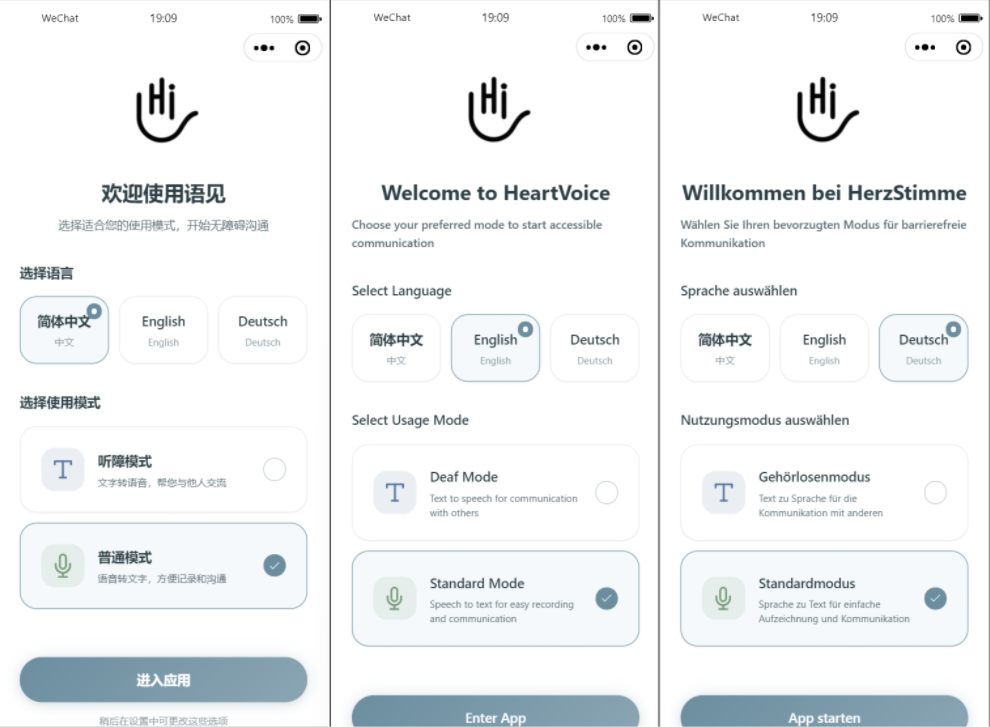
*图1-1：语见的目标用户群体——听障人士与健听人士的沟通桥梁*

>**配图说明**：上图展示了语见的双模式设计理念。左侧为听障模式，界面元素放大，适合视觉敏感用户；右侧为普通模式，信息密度高，适合健听用户。两类用户可以通过语见实现双向无障碍沟通。如暂无真实用户照片，建议使用温暖风格的人物剪影或插画，展示听障人士使用手语、健听人士使用语音的场景对比。

这两类用户的需求看似矛盾——一个偏好文字和视觉，一个偏好语音——但语见通过双模式设计巧妙解决了这一问题。同一款应用，根据用户选择的模式呈现完全不同的界面和功能布局，既满足了差异化需求，又保持了产品的统一性。

围绕双向沟通，语见构建了四个核心场景：手语识别场景让听障人士通过前置摄像头拍摄手语，系统实时转换为文字并语音播报；手语生成场景让健听人士输入文字或语音，系统翻译为三维虚拟人手语动画展示；快捷沟通场景内置常用语快捷库与手语学习资料，方便高频场景快速调用；情感支持场景面向聋哑群体提供情感陪伴、心理疏导与智能辅助服务。

---

## 第二章 双模式设计体系

语见最核心的设计创新在于双模式架构。我们认为，与其做一个折中的设计方案让两类用户都不满意，不如做一个可以根据用户需求变形的弹性设计。就像变形金刚一样，同一个内核，可以根据场景变换形态。

普通模式面向健听用户，界面设计更侧重于信息密度和操作效率，采用常规尺寸的按钮和文字，提供语音输入、手语学习等功能，核心交互是"语音/文字 → 手语动画"。听障模式则完全不同，所有交互元素都进行了放大处理，按钮尺寸更大、文字更粗、对比度更高，提供快捷短语等一键操作功能，核心交互是"手语/文字 → 语音播报"。

| 普通模式 | 听障模式 |
|:--------:|:--------:|
| 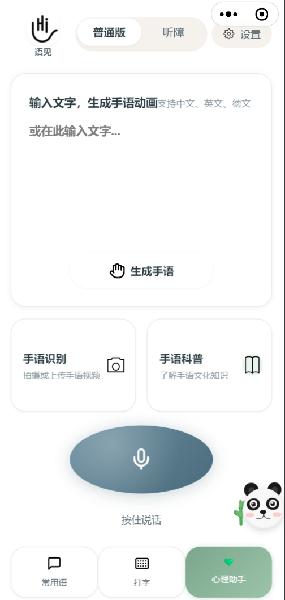 | 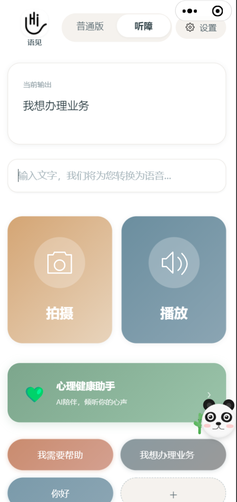 |

*图2-1：双模式首页对比——普通模式侧重信息密度与语音输入，听障模式注重视觉反馈与快捷操作*

>**配图说明**：普通模式界面元素紧凑，适合健听用户高效操作；听障模式文字更大、按钮更醒目，快捷短语一目了然。如需要更完整的对比图，建议截取完整首页截图并排展示。

为了让用户能够方便地在两种模式之间切换，我们在首页顶部设计了胶囊式的模式切换器。这个切换器采用了滑块设计，清晰地指示当前所处的模式。点击切换时，整个页面会以平滑的过渡动画变换到另一种模式，给用户明确的反馈。值得一提的是，模式切换不仅仅影响首页，它是一个全局设置。一旦用户在某个页面切换了模式，整个应用的所有页面都会相应地调整显示方式。这种一致性保证了用户不会在不同页面之间感到困惑。

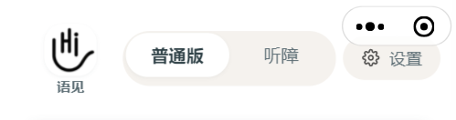

*图2-2：胶囊式模式切换器——清晰的视觉反馈，平滑的过渡动画*

>**配图说明**：顶部导航栏中央的模式切换器采用胶囊设计，当前选中的模式以深色背景高亮显示。建议补充一张切换过程中的动态截图，或展示两种状态（普通/听障）的对比特写。

---

## 第三章 视觉设计系统

语见的色彩设计遵循"温暖疗愈"的理念。我们摒弃了冷冰冰的科技感配色，转而采用更有温度的色调。核心色系包括：宁静蓝灰——带有灰度的蓝色，既保持专业感又不会给用户带来压迫感；温暖琥珀色——象征阳光和生命力，用在主要的操作按钮上；关怀绿色——专门用于心理健康相关的功能模块，传递希望和平静的意象；暖调米白——背景色，像晨光一样柔和，长时间使用不会给眼睛带来疲劳。文字色彩从深到浅分为四个层级，确保信息有清晰的视觉层次，重要内容突出显示，次要内容不会喧宾夺主。

```
┌─────────────────────────────────────────────────────────────┐
│                    语见色彩体系                               │
├─────────────────────────────────────────────────────────────┤
│  ████████  宁静蓝灰    #6B7B8C  导航栏、主要文字               │
│  ████████  温暖琥珀    #F5A623  主要操作按钮、强调色           │
│  ████████  关怀绿色    #7ED321  心理健康模块、正向反馈         │
│  ████████  暖调米白    #F7F5F0  页面背景、卡片底色             │
│  ████████  警示红色    #E74C3C  紧急短语、删除操作             │
│  ████████  业务蓝色    #4A90E2  业务类短语、信息提示           │
└─────────────────────────────────────────────────────────────┘
```

*图3-1：语见色彩体系——温暖疗愈的配色方案*

> 📷 **配图占位**：建议使用设计工具（如Figma、Sketch）制作正式的色彩体系展示图，包含色值、使用场景示例。可参考下图布局：
>
> 
>
> *建议配图内容：左侧为大色块展示主色，右侧小色块展示辅助色，下方标注色值和使用场景*

字体选择直接关系到阅读的舒适度。在语见中，中文字体使用系统默认字体，确保在各种设备上都有良好的显示效果。字号体系采用五级体系，从特小到极大。听障模式下所有文字自动放大到正常模式的1.2倍，行高相应增加。排版上我们遵循了8rpx的网格系统，所有间距都是8的倍数，这种有节奏的留白让界面看起来既整齐又有呼吸感。

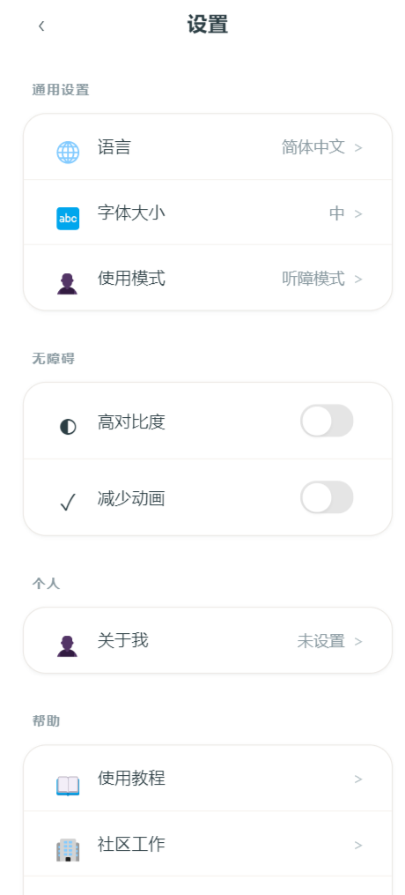

*图3-2：设置页面展示字体层级与排版系统*

| 字号档位 | 听障模式 | 普通模式 | 使用场景 |
|:--------:|:--------:|:--------:|:---------|
| 极小 | 28rpx | 24rpx | 辅助说明、时间戳 |
| 小 | 32rpx | 28rpx | 次要信息、标签 |
| 中 | 36rpx | 30rpx | 正文内容、列表项 |
| 大 | 44rpx | 36rpx | 标题、重要提示 |
| 极大 | 52rpx | 42rpx | 核心数字、紧急信息 |

*表3-1：语见五级字号体系（听障模式自动放大1.2倍）*

> **配图说明**：设置页面展示了中号字体的实际效果。建议补充一张专门的字体层级对比图，展示同一界面在不同字体大小设置下的变化。

语见的界面元素采用了超柔和的圆角设计。不同于市面上常见的直角或小圆角设计，我们将圆角半径放大到了20rpx到48rpx不等，大按钮使用更大的圆角，小标签使用较小的圆角。这种设计让界面元素看起来更加友好、亲和。阴影的使用非常克制，我们采用了低透明度、大扩散范围的阴影风格，模拟真实世界中的柔和光照效果，让界面有层次感和立体感。


*图3-3：卡片式设计——20rpx大圆角与柔和阴影*

> 💡 **配图说明**：快捷入口卡片展示了语见的圆角设计理念——20rpx的大圆角让界面元素看起来更加友好、亲和。建议补充以下特写：
> - 不同尺寸按钮的圆角对比（48rpx大按钮 vs 24rpx小标签）
> - 阴影细节特写（透明度10%、扩散范围20rpx的柔和阴影）
>
> 📷 **补充占位**：
>
> 
>
> *建议配图内容：并排展示三种圆角大小的按钮，标注圆角数值*

---

## 第四章 技术架构与交互设计

语见的技术架构采用了双服务设计。主服务负责手语识别、语音合成、心理咨询对话等功能——手语识别基于Uni-Sign统一生成式框架，语音合成基于ChatTTS模型，心理咨询基于Qwen模型微调。SOKE服务则专门负责3D手语动画的生成，通过将连续三维运动离散化为动作符号，使大语言模型能够自回归地预测手语动作序列。这种分离确保了不同功能之间不会相互影响，即使某个服务暂时不可用，其他功能仍然可以正常使用。
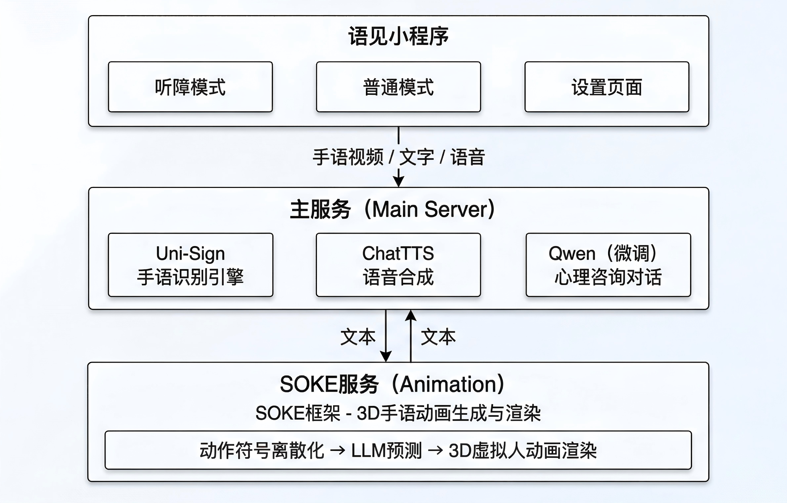

*图4-1：语见技术架构——双服务设计确保功能独立与稳定*

> 📷 **配图占位**：建议使用专业绘图工具（如draw.io、ProcessOn）制作正式的架构图，或使用产品流程图风格：
>
> 
>
> *建议配图内容：使用分层架构图风格，微信小程序层→API网关层→服务层，各服务用图标区分，标注数据流向*

对于听障用户来说，听觉反馈是不可用的，因此我们需要用其他感官通道来补偿。语见在全应用范围内引入了触觉反馈系统，当用户进行任何操作时，手机都会产生轻微的震动，提供即时的操作确认。这种震动不是单一的，而是分层次的：轻触时使用短促的轻震，重要操作时使用稍强的中震，错误提示时则有特定的震动模式。

动画在语见中扮演着重要的角色，它不仅让界面过渡更加流畅，还承担着信息传递的功能。我们的动画设计遵循"自然"的原则，模拟真实世界的物理规律。同时，我们也充分考虑了对动画敏感的用户群体。在设置中提供了"减少动画"选项，开启后所有非必要的动画效果都会被关闭。

```
┌────────────────────────────────────────────────────────────┐
│                    页面过渡动画示意                          │
├────────────────────────────────────────────────────────────┤
│                                                            │
│   ┌─────────┐         ┌─────────┐         ┌─────────┐     │
│   │  首页A   │  ──▶   │  过渡中  │  ──▶   │  页面B   │     │
│   │  透明度  │         │  滑动   │         │  透明度  │     │
│   │  100%   │  300ms  │  +淡入  │  300ms  │  100%   │     │
│   └─────────┘         └─────────┘         └─────────┘     │
│                                                            │
│   按钮点击反馈：缩放0.95x → 恢复1x（100ms弹性动画）           │
│                                                            │
│   ┌────────────────────────────────────────────────────┐  │
│   │  [ 减少动画模式 ]  开关：开启后禁用所有过渡动画        │  │
│   └────────────────────────────────────────────────────┘  │
│                                                            │
└────────────────────────────────────────────────────────────┘
```

*图4-2：语见动画设计原则——自然流畅，可关闭*

> 📷 **配图占位**：动画效果建议使用GIF或短视频展示：
>
> 
>
> *建议配图内容：> 1. 模式切换的页面滑动动画GIF> 2. 按钮点击的缩放反馈GIF> 3. 或直接使用静态图标注动画参数（时长、缓动函数）*

在听障模式下，按钮都设计得比较大，这虽然方便了点击，但也带来了误触的风险。我们通过几种方式来防范误触：重要操作二次确认——删除、取消等危险操作需要二次确认；长按编辑模式——快捷短语的删除功能需要长按进入编辑模式后才能操作；生成任务可取消——手语生成等耗时操作提供了取消按钮。

---

## 第五章 核心功能设计

手语识别功能基于Uni-Sign统一生成式框架，将多种手语识别任务统一建模为序列生成问题，并融合姿态与RGB多模态信息以增强细粒度感知能力。设计重点在于简化操作流程和提供状态反馈。在相机页面，录制按钮有三种状态：未录制时显示为白色，录制中变为红色并带有脉冲动画，录制完成时会有短暂的绿色确认提示。倒计时显示采用了大号数字，让用户清楚地知道还能录制多长时间。

| 状态 | 未录制 | 录制中 | 录制完成 |
|:----:|:------:|:------:|:--------:|
| 截图 | 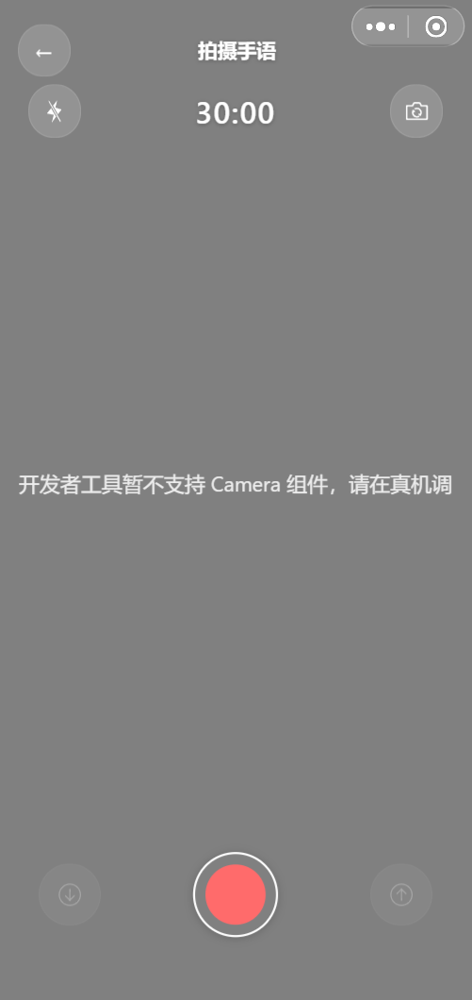 | 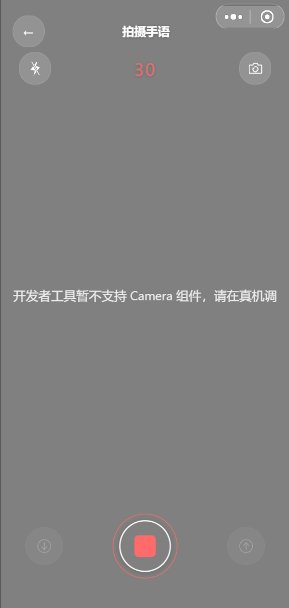 | *[待补充]* |
| 样式 | 白色圆形按钮 | 红色脉冲动画 | 绿色确认提示 |
| 功能 | 点击开始录制 | 显示倒计时 | 自动进入识别 |

*图5-1：录制按钮三态设计——清晰的状态反馈*

>**配图说明**：录制按钮采用颜色+动画的双重反馈机制。未录制时为简洁的白色圆形；录制中变为红色并带有脉冲呼吸动画，同时显示30秒倒计时；录制完成后短暂显示绿色确认，自动跳转识别页面。
>
>
> 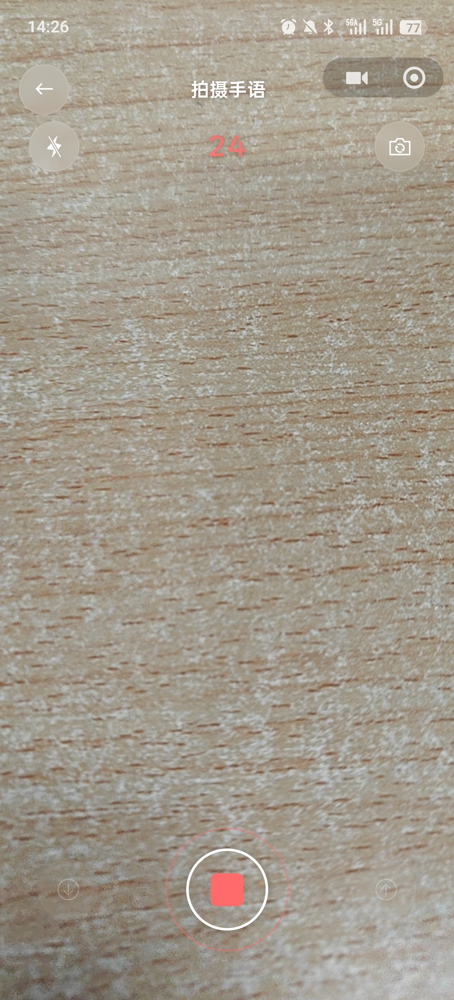

识别过程中的loading设计也很有讲究。我们没有使用简单的转圈动画，而是配合了"正在识别中"的文字说明和进度提示，让用户知道系统正在努力工作。

手语生成功能采用SOKE框架，通过将连续三维运动离散化为动作符号，使大语言模型能够自回归地预测手语动作序列。我们采用了圆形进度环的设计来展示生成进度，相比传统的线性进度条，圆形进度环更加聚焦、更有仪式感。进度环会实时更新，配合百分比数字显示，给用户一种"事情在推进"的感觉。

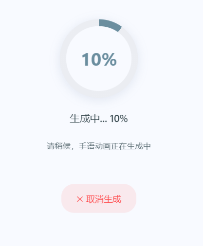

*图5-2：圆形进度环设计——聚焦、有仪式感的等待体验*

>**配图说明**：相比传统线性进度条，圆形进度环更加聚焦。配合百分比数字实时更新，给用户"事情在推进"的确定感。进度环采用品牌蓝灰色，与整体视觉风格一致。

生成完成后的播放器充分考虑了观看体验。视频区域采用居中对齐的布局，确保3D人物模型在屏幕中央完整展示。播放控制条采用毛玻璃效果，既美观又不遮挡视频内容。速度调节功能考虑到学习者的需求，提供了从0.5倍到1.5倍共五档速度，0.75倍速特别适合初学者跟练。

快捷短语是听障模式下的核心功能之一，它让用户能够快速表达常用需求，无需每次都手动输入。短语按钮采用胶囊形状，不同的颜色代表不同的场景：红色代表紧急类如"我需要帮助"，蓝色代表日常类如"谢谢"，灰色代表业务类如"我想办理业务"。这种颜色编码让用户能够快速找到需要的短语。自定义短语的管理也很方便——点击加号可以添加新短语，输入时可以选择这句话的类型，系统会自动赋予对应的颜色；长按任意短语进入编辑模式后，点击短语即可删除。

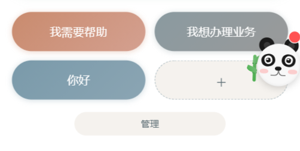

*图5-3：快捷短语颜色编码系统——一目了然的功能区分*

| 颜色 | 场景类型 | 示例短语 | 设计意图 |
|:----:|:--------:|:---------|:---------|
| 🔴 红色 | 紧急类 | "我需要帮助" "请帮我叫救护车" | 紧急情况下快速识别 |
| 🔵 蓝色 | 日常类 | "谢谢" "早上好" "再见" | 高频社交用语 |
| ⚫ 灰色 | 业务类 | "我想办理业务" "请出示证件" | 正式场合、办事场景 |
| 🟢 绿色 | 自定义 | 用户添加的个人常用语 | 个性化表达 |

*表5-1：快捷短语颜色编码体系*

>**配图说明**：快捷短语采用胶囊形状设计，圆角柔和友好。长按进入编辑模式后显示删除标记。建议补充一张编辑模式的截图或长按操作的说明图。

---

## 第六章 心理健康模块设计

心理健康功能是语见区别于普通翻译工具的重要特色。我们意识到，听障群体由于沟通障碍，往往承受着更大的心理压力，却缺乏便捷的心理咨询渠道。基于Qwen模型微调的情感支持智能体，在情感支持专用对话数据上进行了适配训练，并针对聋哑群体常见的语序与表达特点做了专项优化。

一个可爱的悬浮小熊猫作为入口，位于屏幕右下角，会不定期地轻轻摇晃，像是在跟用户打招呼。点击后，小熊猫会弹出一个温馨的对话框，用友好的语言邀请用户聊天。进入心理咨询页面后，用户会看到一个温馨的对话界面，这里就像是一位随时在线的朋友，愿意倾听用户的喜怒哀乐。页面的配色采用了舒缓的绿色系，这是经过心理学研究证实能够让人感到平静的颜色。对话界面模仿了熟悉的聊天软件布局，降低了用户的使用门槛。

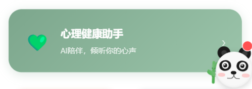

*图6-1：心理健康模块入口——可爱的小熊助手*

>**配图说明**：悬浮于屏幕右下角的小熊入口，采用温暖的绿色配色，与心理健康主题呼应。小熊会不定期轻轻摇晃，吸引用户注意的同时不打扰主要操作。
>
> 📷 **补充占位**：建议补充以下截图：
> 1. 点击小熊后弹出的对话气泡（邀请语："有什么想和我聊聊的吗？"）
> 2. 小熊摇晃的动画帧或GIF
>
> 

为了让听障用户也能方便地使用心理咨询功能，我们在这个模块中也集成了手语输入支持。用户可以通过摄像头用手语表达自己的情绪和困惑，系统会将手语识别为文字后发送给AI助手。AI助手支持检索增强生成与网络搜索等工具调用能力，为用户提供情感陪伴、心理疏导与智能辅助服务。

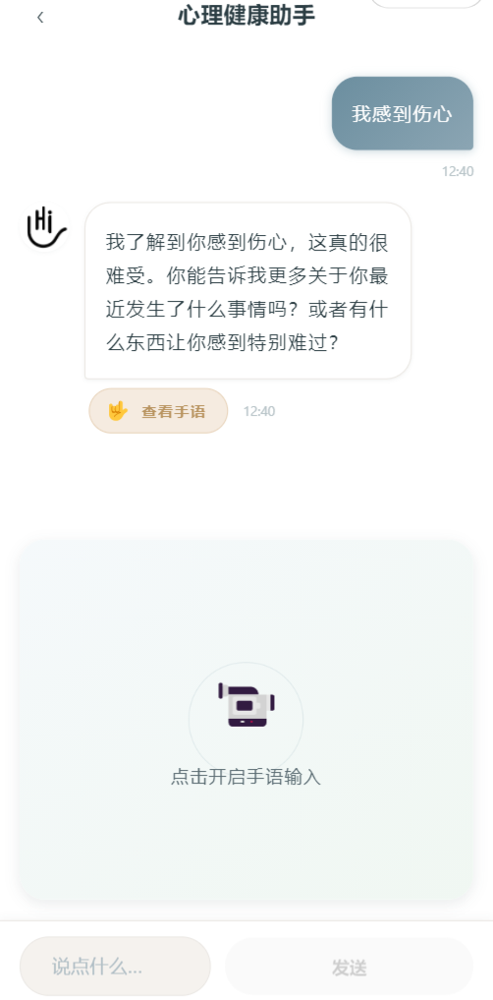

*图6-2：心理咨询对话界面——随时在线的情感支持*

| 功能区域 | 说明 |
|:--------:|:-----|
| 顶部 | 标题栏显示"心理健康助手"，返回按钮 |
| 中部 | 对话消息流，区分用户与AI头像 |
| 底部 | 手语输入按钮 + 文字输入框 + 发送按钮 |

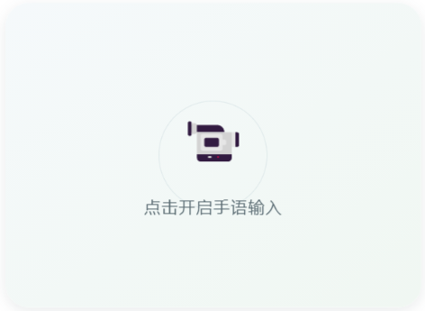

*图6-3：心理咨询中的手语支持——点击手语按钮启动摄像头*

>**配图说明**：心理咨询界面采用舒缓的绿色系配色，降低用户的心理防御。手语输入按钮位于底部工具栏左侧，点击后展开摄像头区域，支持实时手语识别。

---

## 第七章 无障碍设计细节

除了双模式设计外，语见还提供了多项视觉无障碍功能。高对比度模式开启后文字与背景的对比度会进一步提高，适合视力较弱的用户。字体大小调节提供了五档选择，覆盖了从正常视力到严重视力受损的不同需求。图标文字标签确保所有的图标都配有文字标签，不会因为只看图标而产生歧义。

| 普通模式 | 高对比度模式 |
|:--------:|:------------:|
|  | 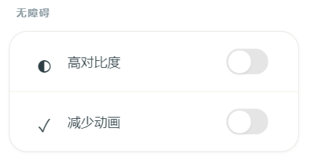 |
| 标准对比度 | 增强对比度 |
| 柔和阴影 | 清晰边框 |
| 渐变背景 | 纯色背景 |

*图7-1：无障碍模式对比——为视力障碍用户提供更清晰的视觉体验*

>**配图说明**：高对比度模式通过增强文字与背景的对比度、使用清晰边框代替柔和阴影，让视力较弱的用户更容易辨识界面元素。可在设置-无障碍中一键开启。

语见的界面元素都正确设置了ARIA标签，确保屏幕阅读器能够准确识别和播报。按钮、输入框等交互元素都有明确的状态指示，焦点管理清晰，使用键盘或辅助设备的用户也能够顺畅地操作应用。

考虑到用户可能在网络不稳定的环境下使用，我们在设计中做了许多离线友好的处理：用户的设置、快捷短语等都保存在本地，只有在进行手语识别、生成手语动画、使用心理咨询功能时才需要联网，网络请求优化了超时时间和重试机制。

---

## 第八章 国际化设计

语见目前支持简体中文、English和Deutsch三种语言。国际化不仅仅是文字的翻译，还涉及到整个界面布局的调整。比如德语单词通常较长，在按钮等空间有限的地方需要调整字号或换行显示。我们在代码层面采用了完整的国际化框架，所有用户可见的文字都通过翻译键来管理。

| 简体中文 (zh-CN) | English (en-US) | Deutsch (de-DE) |
|:----------------:|:---------------:|:---------------:|
|  | 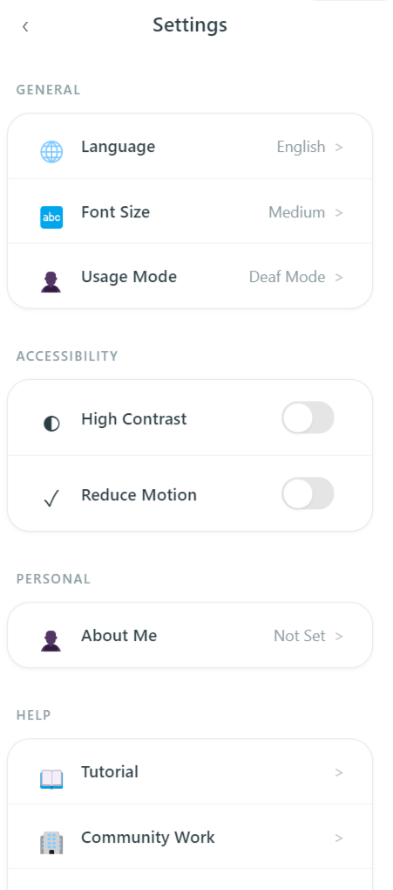 | 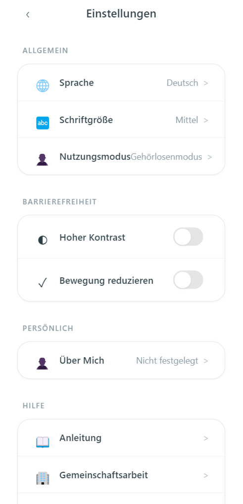 |
| 语见 | HeartVoice | HerzStimme |
| 设置 | Settings | Einstellungen |
| 字体大小：中 | Font Size: Medium | Schriftgröße: Mittel |

*图8-1：多语言支持——简体中文、English、Deutsch*

>**配图说明**：语见支持三种语言界面切换，所有用户可见文本都通过国际化框架管理。德语版本针对长单词做了特殊适配。
>
> 📷 **补充占位**：建议补充英文版和德语版的设置页截图，制作三列并排对比图：
>
> 

不同文化背景下的用户对色彩、图标、甚至交互方式的理解可能不同。在设计时我们考虑到了未来的扩展性：色彩选择避开了在某些文化中有负面含义的颜色，图标设计采用了普遍易懂的符号，避免使用地域性太强的隐喻。

---

## 第九章 未来展望

语见的第一个版本奠定了产品的基础框架，未来我们还有大量的优化空间。手语识别方面，随着训练数据的积累，识别准确率会不断提升，支持的词汇量也会扩大。手语生成方面，正在研究更自然的动作捕捉技术，让生成的动画更加流畅、表情更加丰富。心理咨询方面，引入更专业的情感计算模型，提供更精准的心理支持建议。

```
┌──────────────────────────────────────────────────────────────────────────────┐
│                             语见产品路线图 V1 → V3                            │
├──────────────────────────────────────────────────────────────────────────────┤
│                                                                              │
│   V1.0 (当前)                    V2.0 (规划中)                  V3.0 (愿景)   │
│   ───────────                    ───────────                   ───────────  │
│                                                                              │
│   ┌─────────┐                   ┌─────────┐                   ┌─────────┐   │
│   │基础识别 │  ──────────────▶  │增强识别 │  ──────────────▶  │连续识别 │   │
│   │300词汇  │                   │1000词汇 │                   │自然对话 │   │
│   └─────────┘                   └─────────┘                   └─────────┘   │
│                                                                              │
│   ┌─────────┐                   ┌─────────┐                   ┌─────────┐   │
│   │基础生成 │  ──────────────▶  │表情增强 │  ──────────────▶  │情感表达 │   │
│   │标准动作 │                   │面部细节 │                   │个性化动作│   │
│   └─────────┘                   └─────────┘                   └─────────┘   │
│                                                                              │
│   ┌─────────┐                   ┌─────────┐                   ┌─────────┐   │
│   │文本咨询 │  ──────────────▶  │语音咨询 │  ──────────────▶  │专业转介 │   │
│   │AI陪伴   │                   │情绪识别 │                   │真人对接 │   │
│   └─────────┘                   └─────────┘                   └─────────┘   │
│                                                                              │
│   2024 Q1-Q2                    2024 Q3-Q4                    2025+          │
│                                                                              │
└──────────────────────────────────────────────────────────────────────────────┘
```

*图9-1：语见产品路线图——从基础功能到智能生态的演进*

>**配图占位**：建议使用产品路线图工具（如Roadmunk、ProductPlan）或设计工具制作正式的路线图：
>
> 
>
> *建议配图内容：> - 时间轴形式，横向展示版本演进> - 每个版本用色块区分功能模块（识别/生成/心理）> - 标注关键里程碑和预期时间*

设计语言也会随着产品的成熟而演进。我们会持续关注用户的反馈，根据实际使用情况调整设计细节。同时，随着操作系统的更新和设计趋势的变化，语见的视觉风格也会保持适度的新鲜感，但核心的温暖、包容的设计哲学不会改变。

---

## 结语

设计一款真正无障碍的应用是一项充满挑战的工作。它需要设计者跳出自身的视角，真正理解不同用户群体的需求；需要在技术可行性和用户体验之间寻找平衡；需要在功能丰富和界面简洁之间做出取舍。

语见的设计过程让我们深刻体会到，好的设计是有温度的。那些看不见的细节——比如一个按钮的圆角大小、一次震动的力度、一句提示语的措辞——都在潜移默化中影响着用户的感受。

通过将先进的人工智能模型轻量化部署至移动端，语见打造了一个功能高度整合、交互简洁直观的双向手语翻译与生成平台。我们希望通过语见，不仅解决实际的沟通问题，更传递出一种态度：每个人的声音都值得被听见，每个人的需求都应该被尊重。

这份设计理念文档记录了我们在这个旅程中的思考，也希望它能成为团队未来决策的参考，让语见始终保持初心，成为用户信赖的沟通伙伴。

"无声世界，语见其声"


*图10-1：语见品牌标识——无声世界，语见其声*

---

```
┌─────────────────────────────────────────────────────────────────┐
│                                                                 │
│                    "无声世界，语见其声"                           │
│                                                                 │
│         每个人的声音都值得被听见                                  │
│         每个人的需求都应该被尊重                                  │
│                                                                 │
│                     💙 语见团队 💙                                │
│                                                                 │
└─────────────────────────────────────────────────────────────────┘
```

*图10-2：语见设计愿景*

> 📷 **配图占位**：建议在此处放置：
> 1. 团队合影（开发团队、设计团队合照）
> 2. 设计过程照片（白板讨论、用户访谈场景）
> 3. 品牌概念插画（手语与语音交汇的意象图）
> 4. 或用户使用产品的真实场景照片
>
> 
>
> *配图建议：温暖、真实、有人情味的照片，与"有温度的设计"理念呼应*
